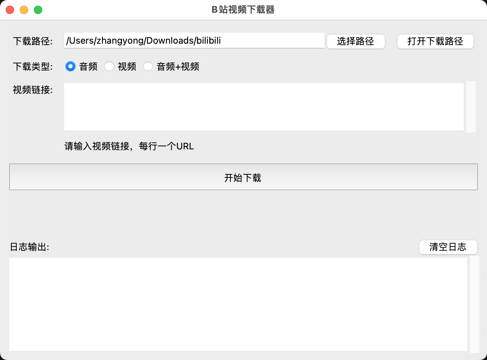

# B站视频下载器

## 声明

**此项目只供学习使用，请尊重视频原创作者的著作权。**

任何使用此项目下载的视频内容均应遵守相关法律法规，不得用于商业用途或其他侵犯版权的行为。请支持正版，尊重创作者的劳动成果。


## 项目简介

这是一个使用Python开发的B站视频下载器，具有图形用户界面（GUI）。它可以从B站下载视频并将其转换为音频格式。

## 主要功能

- 从B站下载视频
- 将视频转换为音频（默认为MP3格式）
- 支持批量下载（每行一个URL）
- 可自定义下载路径和音频格式
- 实时显示下载进度
- 提供详细的日志输出

## 技术栈

- Python 3
- tkinter（GUI库）
- yt-dlp（视频下载库）
- threading（多线程支持）

## 安装说明

1. 确保您的系统已安装Python 3。

2. 克隆此仓库：
   ```
   git clone https://github.com/your-username/bilibili-downloader.git
   cd bilibili-downloader
   ```

3. 安装所需的依赖：
   ```
   pip install -r requirements.txt
   ```

## 使用方法

1. 运行主程序：
   ```
   python src/DownloaderApp.py
   ```

2. 在GUI界面中：
   

   - 选择下载路径
   - 选择下载类型（音频、视频、音频+视频）
   - 在文本框中输入B站视频URL（每行一个）
   - 点击"开始下载"按钮

3. 程序将开始下载视频并转换为音频，进度和日志将实时显示在界面上。

## 注意事项

- 请确保您有权下载和使用相关视频内容。
- 下载速度可能受到网络条件和B站服务器负载的影响。
- 某些视频可能因版权或其他原因无法下载。

## 贡献指南

欢迎对本项目提出改进建议或直接贡献代码。请遵循以下步骤：

1. Fork 本仓库
2. 创建您的特性分支 (`git checkout -b feature/AmazingFeature`)
3. 提交您的改动 (`git commit -m 'Add some AmazingFeature'`)
4. 将您的改动推送到分支 (`git push origin feature/AmazingFeature`)
5. 开启一个 Pull Request

## 许可证

本项目采用 MIT 许可证。详情请见 [LICENSE](LICENSE) 文件。

## 联系方式

如有任何问题或建议，请po issue